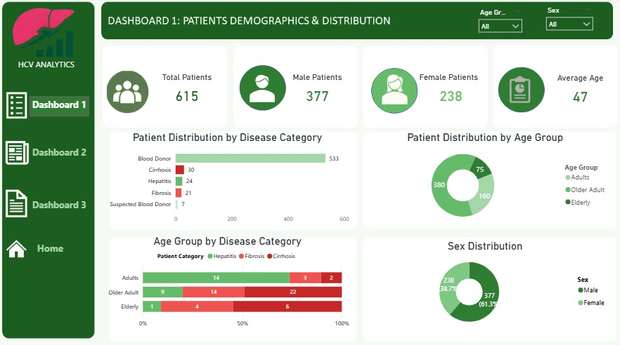
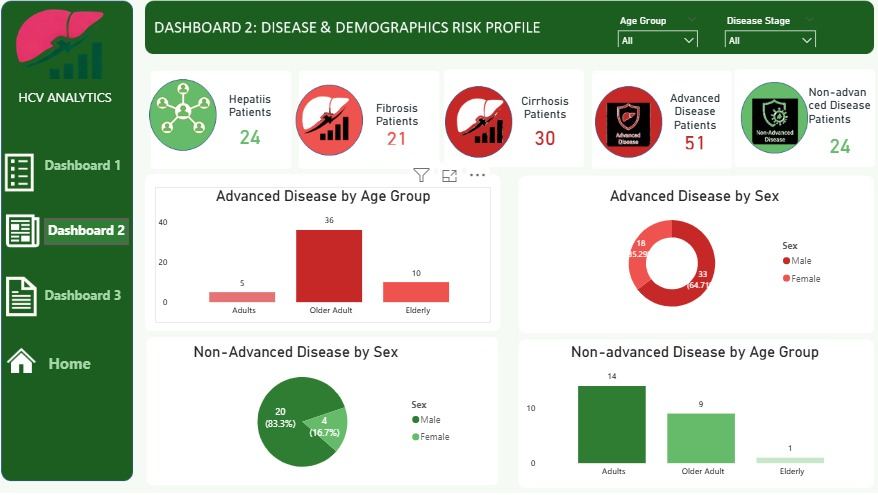
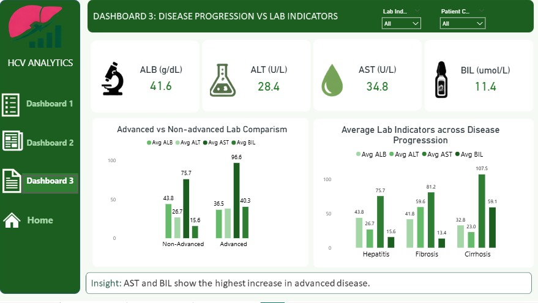

#Hepatitis Data Analysis Project 

Project Overview

This project analyses patient data to identify patterns in hepatitis disease, with a focus on disease distribution, demographic characteristics, disease progression, and laboratory indicators.

The project was developed as a practical application of healthcare data analytics skills using Microsoft Excel and Power BI.

Project Objectives

- Analyse the distribution of patients across diagnostic categories.
- Identify demographic patterns associated with advanced disease.
- Examine differences in laboratory indicators across disease progression.
- Generate actionable insights and recommendations to support patient monitoring.

Business Questions

1. What is the distribution of patients across the different diagnostic categories?
2. What demographic patterns are associated with advanced disease?
3. How do laboratory indicators differ across disease progression?
4. What areas should be prioritised for patient monitoring?

Dataset

The dataset contains 615 patient records and includes demographic, diagnostic, and laboratory information.

Diagnostic Categories

- Blood Donor
- Suspected Donor
- Hepatitis
- Fibrosis
- Cirrhosis

Key Variables

Demographics

- Age
- Sex

Laboratory Indicators

- ALB
- ALT
- AST
- BIL

Data Preparation

Data cleaning and preparation were performed using Microsoft Excel.

The process included:

- Identifying and correcting inconsistent entries.
- Handling missing laboratory values.
- Standardising diagnostic categories.
- Standardising variable formats and abbreviations.
- Creating a patient ID.
- Creating disease classification variables for analysis.

Data Analysis

The cleaned dataset was analysed using Excel and Power BI.

Analysis focused on:

- Patient and disease distribution.
- Age and sex patterns.
- Advanced versus non-advanced disease.
- Laboratory indicator patterns across disease progression.

## Power BI Dashboards

### Dashboard 1 — Patient Demographics & Distribution

This dashboard presents:

- Total patients
- Male and female patients
- Average age
- Patient distribution by disease category
- Patient distribution by age group
- Sex distribution
- Age group by disease category

### Dashboard 2 — Disease & Demographic Risk Profile

This dashboard examines:

- Advanced disease
- Non-advanced disease
- Disease patterns by age group
- Disease patterns by sex

### Dashboard 3 — Disease Progression & Laboratory Indicators

This dashboard examines laboratory patterns across disease progression using ALB, ALT, ALP, AST and BIL.

Key Insights

- The dataset contained 615 patients, with males representing the larger proportion of the study population.
- Advanced disease was more prominent among older adults.
- Male patients had a higher representation across the identified disease categories.
- Laboratory indicators showed varying patterns across disease progression, particularly for indicators such as AST and BIL.
- The findings highlight the importance of demographic and laboratory monitoring in patients with progressive liver disease.

Recommendations

- Prioritise monitoring: Strengthen monitoring of patients with advanced disease, particularly older adults.
- Focus on high-risk groups: Pay closer attention to demographic groups showing a higher burden of advanced disease.
- Monitor laboratory patterns: Regularly monitor key laboratory indicators to identify changes associated with disease progression.
- Support early intervention: Use demographic and laboratory patterns to support timely clinical assessment and intervention.

Tools Used

- Microsoft Excel — Data cleaning and preparation
- Power BI — Data modelling, analysis, visualisation and dashboard development

Project Outcome

This project provided an opportunity to apply healthcare data analytics skills to a real-world clinical dataset, transforming raw patient data into meaningful insights through Excel and Power BI.

---

Author

Grace Job Egberis

Healthcare Data Analyst | Registered Nurse 

Linkedin https://www.linkedin.com/in/grace-egberis-91524038a
